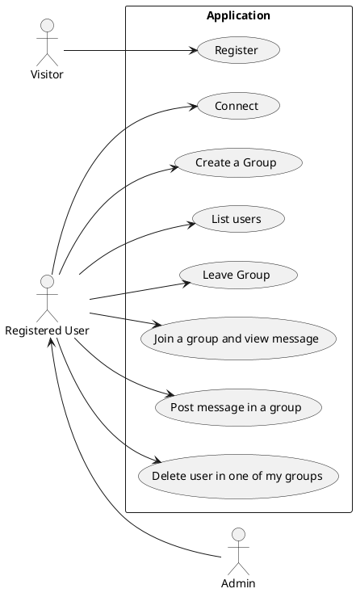
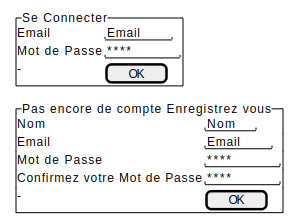
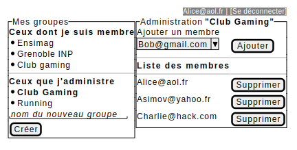
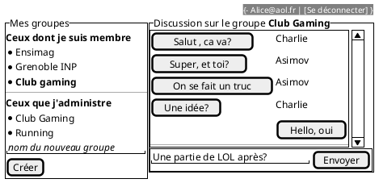
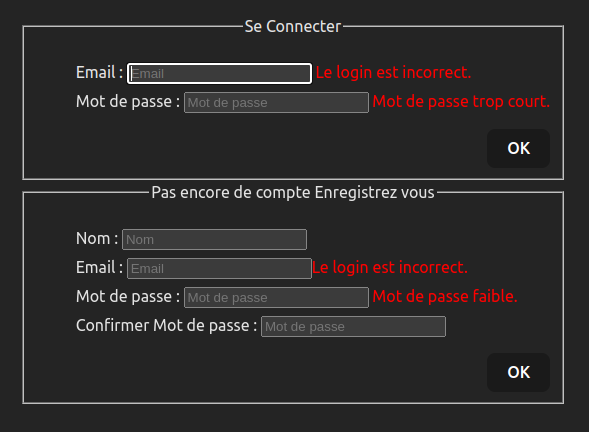
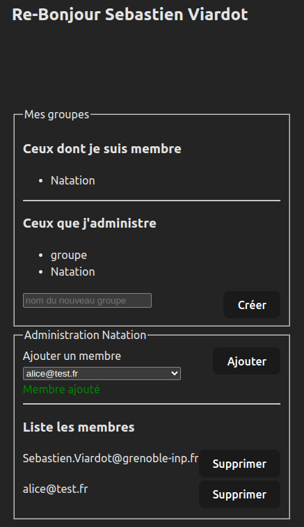
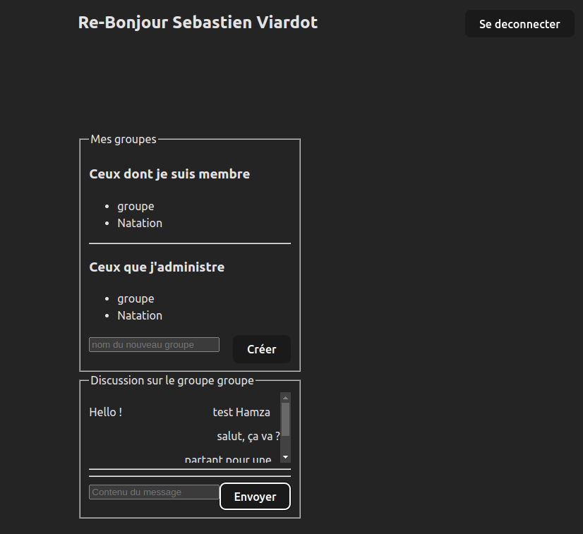
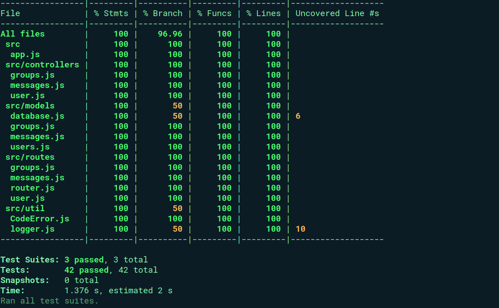
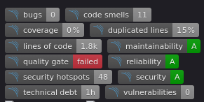

---
title: Projet React 
author: Bouihi Hamza, Sassier Louis
--- 

## Cahier des charges

Ici vous décrivez les fonctionnalités souhaitées et celles effectivement mises en oeuvre. Avec un diagramme UML des cas d'usage et des maquettes des vues souhaitées et des captures d'écran de ce qui a été réalisé.

### Cas d'usage

Toutes les fonctionnalités qui sont à faire dans le TP Backend sont gérées correctement au niveau du backend

Néanmoins, pour la partie FrontEnd, seulement une partie de ces fonctionnalités sont accessibles depuis notre page web:



### Maquettes






### Captures d'écran





### API mise en place

Pour accéder à la doc de l'api générée par swagger, executez les commandes suivantes dans votre terminal:

- cd backend
- npm install
- npm run doc
- npx nodemon src/server.js

Ensuite, dans votre navigateur préféré, rendez vous à la page ayant pour URL <http://localhost:3000/doc/>

## Architecture du code

### FrontEnd

Indiquer ici l'organisation de votre code. Et les choix faits pour le frontend.

### Backend

#### Obtension d'un token d'accès

Requête LOGIN:

```json
POST "http://localhost:3000/login"
x-www-form-urlencoded:
{
  "email" : "hamza@gmail.com",
  "password" : "7t@R&%k1Lm!Pz94"
}
```

Résultat:

```json
{
  "status": true,
  "message": "Login/Password ok",
  "token":"eyJhbGciOiJIUzI1NiJ9aGFtemFAZ21haWwuY29tfFdbgQfAeqrtY1LKrQD_VeYoP04AbjlaFlfZPiF0zug"
}
```

#### Schéma de votre base de donnée

```plantuml
class User{
  name
  email
  passhash
  isAdmin : boolean
}

class Message{
  content
  authorName
}

class Group{
  name
}

User "1" -- "n" Message : posts
Group "1" -- "n" Message : contains

User "n" -- "n"  Group : is member 
User "1" -- "n"  Group : create and own
```

#### Architecture de votre code

Nous avons essayé de conserver la structure déja présente dans le repertoire backend, c'est à dire:

Le répertoire **src/models/** contient les fichiers:

```txt
  - groups.js
  - users.js
  - messages.js
  - database.js
```

Ces fichiers s'occupent de la définition des tables et de la définition des relations qu'elles possèdent entre-elles.

Le répertoire **src/routes/** contient les fichiers:

```txt
  - groups.js
  - user.js
  - messages.js
  - router.js
```

Ces fichiers s'occupent de la création des endpoints pour chaque requête ainsi que de la selection des middlewares et fonctions appelés selon l'endpoint et le type de requête concernée.

Le répertoire **src/controllers/** contient les fichiers:

```txt
  - groups.js
  - user.js
  - messages.js
```

Ces fichiers s'occupent de l'implémentation des fonctions et middlewares appelées dans **src/routes/**.

Le répertoire **src/test/** contient les fichiers:

```txt
  - api.user.test.js
  - api.message.test.js
  - api.group.test.js
```

Ces fichiers s'occupent de tester le bon fonctionnement des parties du tp correspondantes.

### Gestion des rôles et droits

Expliquer ici les différents rôles mis en place, et comment ils sont gérés dans votre code.

- Coté backend

Il n'y a que 2 rôles disponibles, Administrateur et Utilisateur. Un administrateur est un utilisateur mais un utilisateur n'est pas forcément un admin.

D'un point de vue de droits, un admin peut gérer tous les groupes qui existent contrairement aux autres utilisateurs. Il peut en plus de cela, virer de l'application un utilisateur ou le rendre lui aussi admin en mettant à jour ses informations personnelles.

- Coté frontend

Côté frontEnd, c'est la même chose, seulement la fonctionnalité de supprimer un utilisateur de l'application ou mettre à jour ses informations n'a pas encore été implémentée.

## Test

### Backend-test

Les tests fait pour la partie backend ont une couverture de 100% (sans compter l.6 de src/models/database.js et l.10 de src/util/logger.js qui ne sont pas testé entièrement)

Pour vérifier cela, il suffit de run les tests en exécutant les commandes suivantes dans votre terminal:

- cd backend
- npm install
- npx nodemon src/server.js &; npm run test



### Frontend-test

Pour tester le FrontEnd, nous avons utilisé cypress, où nous sinterceptons les requêtes afin d'y repondre avec des fichiers .json présents dans **src/cypress/fixtures**. Ainsi, les tests peuvent être lancés à plusieurs répétitions sans pour autant modifier la base de donné sur scalingo.

Pour leurs couvertures, nous avons implémentés les tests de toutes les fonctionnalités et apparitions des messages d'erreurs corrects pour la partie Login. Pour la partie groupe, nous avons implémentés les tests des fonctionnalités disponibles mais nous avons seulement tester à la main le bon fonctionnement de l'appartition des messages d'erreurs. Enfin, pour la partie message, nous n'avons pas eu le temps d'implémenter les tests des fonctionnalités mais nous avons vérifiés nous par nous même du bon fonctionnement des fonctionnalités disponibles.

## Intégration + déploiement (/3)

Au niveau de l'intégration continu, nous avons mis en place:

- EsLint
- sonarqube
- semgrep-security
- backend-test
- jobcypress
- scalingo (exposer l'API sur Scalingo)
- pages (mise en ligne du frontend)
- badges (afficher les différents badges résulant des tests cypress et eslint qui ne sont pas affichés sur la photos mais bien présents sur le git)



## Installation

Si vous ne voulais pas récupérer notre app en local mais y avoir accès depusi internet, il vous suffit d'accéder, sur votre navigateur préféré, à la page web suivante: <https://tp5-6-backend-react-hamza-bouihi-louis-sassier-g-866d1241448871.pages.ensimag.fr/>

Sinon, après avoir télécharger le projet:

Si vous voulez tester notre frontend:

- cd backend
- npm install
- npx nodemon src/server.js &
- Dès lors vous serez en mesure de tester notre backend en envoyant les requêtes à l'adresse:  <http://localhost:3000/>

Sinon si vous voulez tester notre frontend:

- cd frontend
- npm install
- npm run dev
- Dès lors vous serez en mesure de tester localement notre appweb à l'adresse: <http://localhost:/5173>
